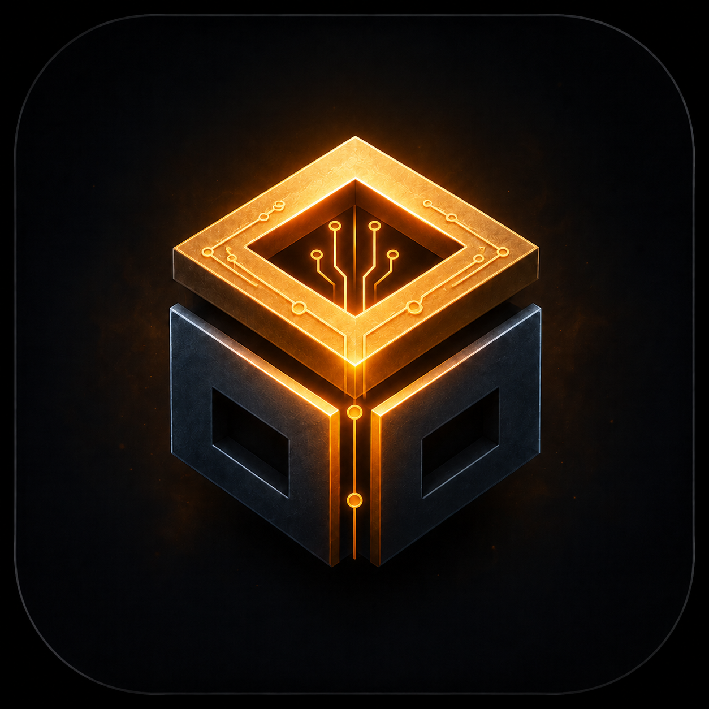

<div align="center">



# IntelaCraft

**AI-assisted control for Minecraft Bedrock Dedicated Server**

Describe what you want in natural language. The AI inspects your world, proposes a plan, and executes changes safely — with your approval.

[](docs/reference/protocol.md)
[](https://nodejs.org)
[](https://www.minecraft.net/en-us/download/server/bedrock)
[](LICENSE)

</div>

---

- [x] **Natural language control** — Describe tasks in plain English, the AI figures out the Minecraft commands
- [x] **Human-in-the-loop** — Every world change requires your explicit approval before execution
- [x] **Ask / Agent modes** — Toggle between read-only Ask mode and full Agent mode with tools
- [x] **Safety by default** — Protected regions, volume limits, emergency kill switch, full audit trail
- [x] **Live world inspection** — Query players, blocks, entities, time, weather, scoreboards, and more
- [x] **Real-time streaming** — Watch the AI think and execute in real-time through the web panel

---

## Quick Start

**Prerequisites:** Node.js 20+, Minecraft BDS, and an AI provider API key (OpenAI, Anthropic, Google, Groq, Ollama, or any OpenAI-compatible endpoint)

```powershell
npm run setup     # install deps, build, create .env
npm run dev       # start controller at http://127.0.0.1:8787
```

Open the webview, enter your bearer token, connect an AI provider, and start talking to your server.

---

## How It Works

```
You: "Build a 10x10 stone house at 0,64,0"
         |
         v
   AI agent inspects the world (players, blocks, time, weather)
         |
         v
   Agent proposes a plan with risk assessment:
     - inspect: check current state at coordinates
     - mutate: fill 100 blocks with minecraft:stone (normal risk)
     - verify: inspect the region after building
         |
         v
   You review and approve in the web control panel
         |
         v
   Behavior pack executes the fill on your BDS server
         |
         v
   Results stream back in real-time
```

---

## Commands

| Command | What it does |
|---------|-------------|
| `npm run setup` | Install + build + create `.env` |
| `npm run dev` | Start controller (serves webview + API) |
| `npm run build` | Build all packages in dependency order |
| `npm run test` | Run workspace tests |
| `npm run typecheck` | Type-check all workspaces |
| `npm run health` | Check controller/BDS connectivity |
| `npm run deploy` | Deploy behavior/resource packs to BDS |
| `npm run configure-bds` | Write BDS config from `.env` |
| `npm run inspect` | Inspect running system state |
| `npm run combine-docs` | Regenerate `docs/ALL.md` |
| `npm run agent-eval` | Run agent evaluation cases |
| `npm run load-smoke` | Run load smoke tests |
| `npm run start` | Alias for `dev` |

---

## Provider Support

IntelaCraft works with any OpenAI-compatible `/v1/chat/completions` endpoint. Supports configurable reasoning/thinking levels across all compatible providers.

| Provider | Base URL | Recommended Models | Notes |
|----------|----------|-------------------|-------|
| **OpenAI** | `https://api.openai.com/v1` | `gpt-5.6-sol`, `gpt-5.6-terra`, `gpt-5.6-luna` | Flagship reasoning, 1M+ context, configurable thinking |
| **Anthropic** | `https://api.anthropic.com/v1` | `claude-sonnet-5`, `claude-opus-4-8`, `claude-haiku-4-5` | Adaptive thinking, 1M context |
| **Google** | `https://generativelanguage.googleapis.com/v1beta` | `gemini-3.1-pro`, `gemini-3.5-flash` | Thinking mode, multimodal |
| **Groq** | `https://api.groq.com/openai/v1` | `openai/gpt-oss-120b`, `llama-3.3-70b-versatile` | Fastest inference, free tier available |
| **Ollama** | `http://localhost:11434/v1` | `deepseek-r1`, `qwen3.5`, `gemma4`, `gpt-oss` | No API key, fully local |
| **OpenRouter** | `https://openrouter.ai/api/v1` | `openai/gpt-5.6-sol`, `anthropic/claude-sonnet-5`, `google/gemini-3.1-pro` | Multi-provider aggregator |
| **Mistral** | `https://api.mistral.ai/v1` | `mistral-medium-2508`, `mistral-small-2503` | Open-weight, adaptive thinking |
| **DeepSeek** | `https://api.deepseek.com/v1` | `deepseek-v4-flash`, `deepseek-v4-pro` | 1M context, thinking modes, very cost-effective |

---

## Documentation

Full documentation is in [`docs/INDEX.md`](docs/INDEX.md).

| Topic | Link |
|-------|------|
| Architecture | [docs/architecture/](docs/architecture/overview.md) |
| API Reference | [docs/reference/api.md](docs/reference/api.md) |
| Configuration | [docs/reference/configuration.md](docs/reference/configuration.md) |
| Protocol | [docs/reference/protocol.md](docs/reference/protocol.md) |
| Development | [docs/guides/development.md](docs/guides/development.md) |
| Deployment | [docs/guides/deployment.md](docs/guides/deployment.md) |
| Provider Setup | [docs/guides/provider-setup.md](docs/guides/provider-setup.md) |
| Troubleshooting | [docs/troubleshooting.md](docs/troubleshooting.md) |

Or combine all docs into one file: `npm run combine-docs`

---

## License

[MIT License](LICENSE) — Copyright (c) 2026 IntelaCraft Contributors
